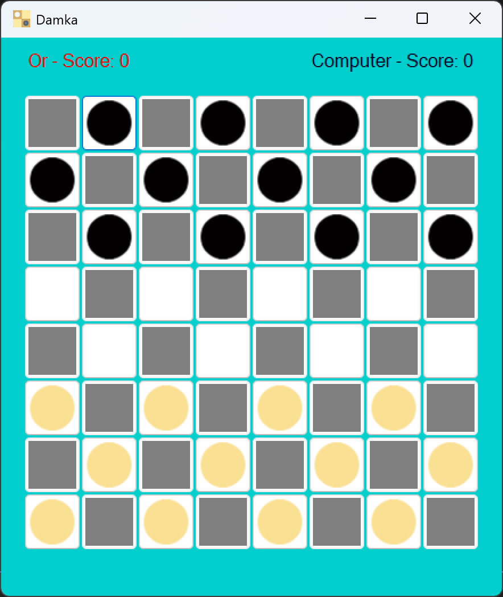
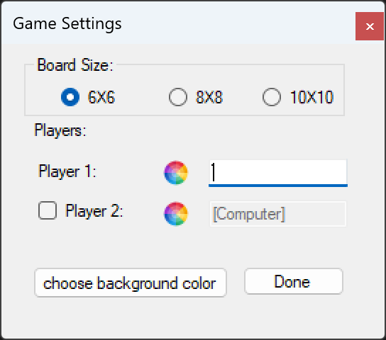
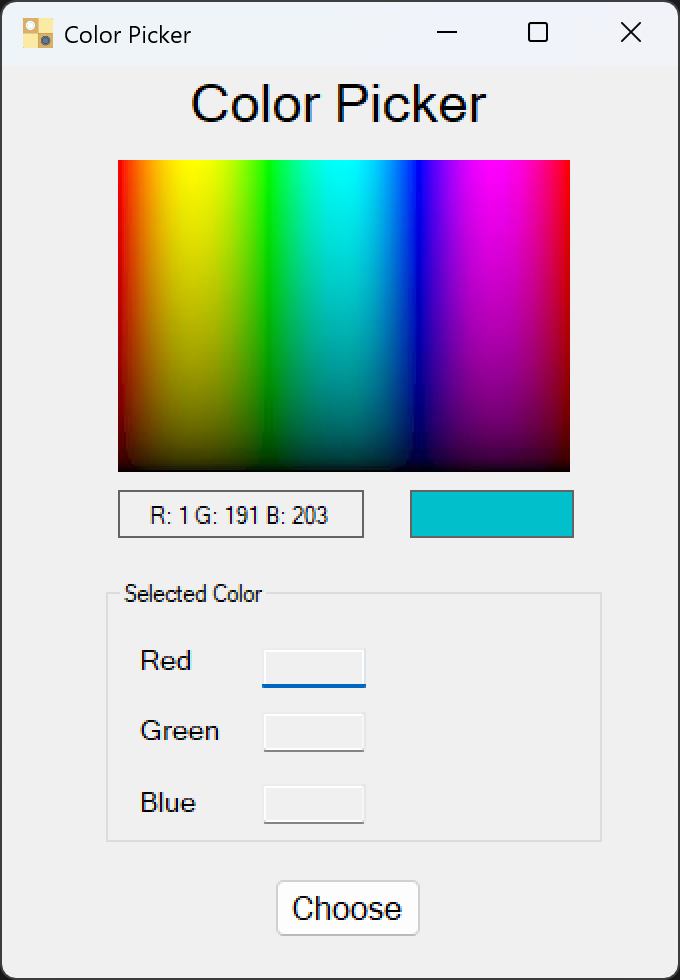
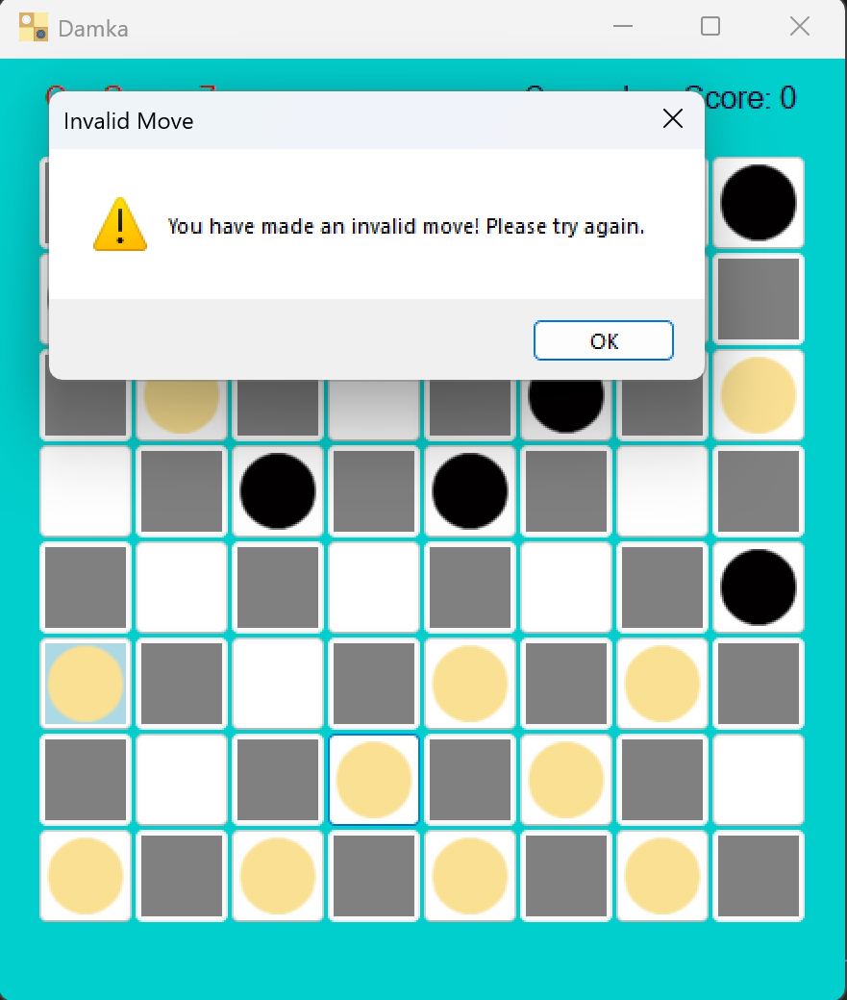
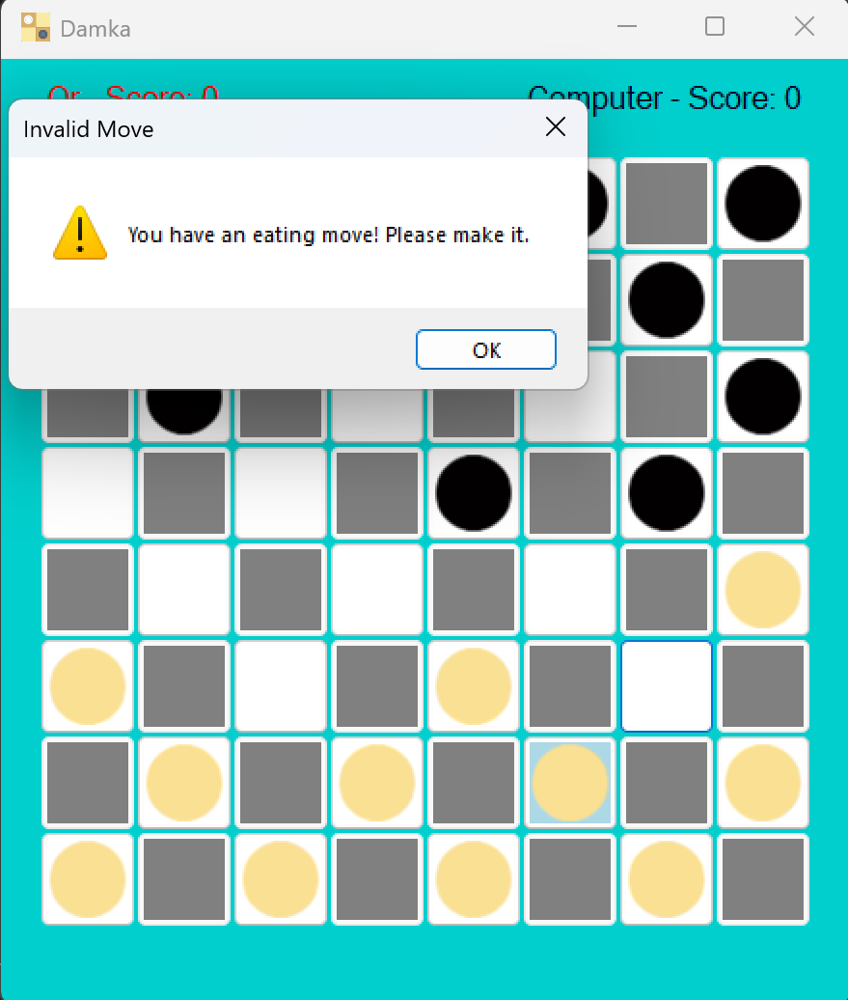
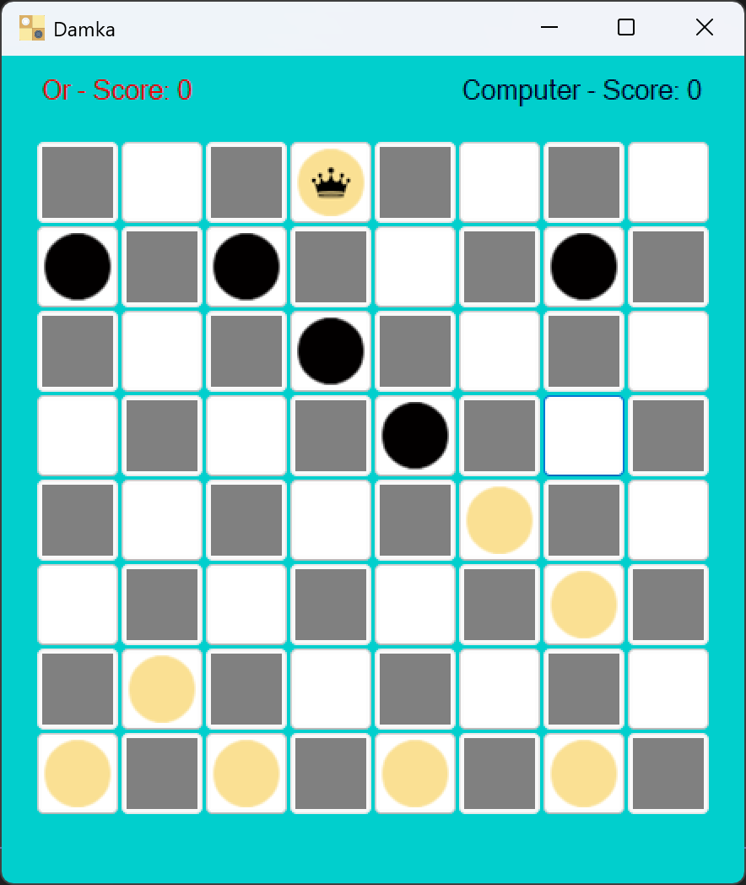
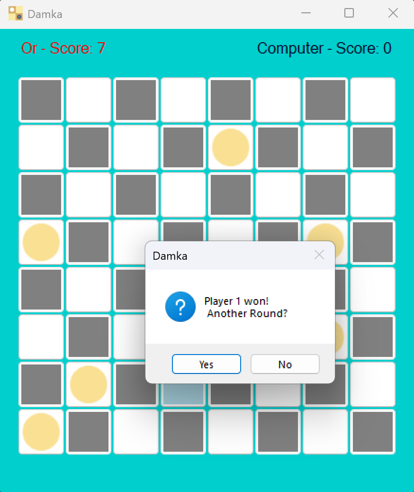

# Checkers Game (Damka) – C# WinForms

A fully featured **Checkers (Damka)** game implemented in **C# using WinForms**, developed as part of an Object-Oriented Programming course.

---

## 🎮 Features

- Classic Checkers (Damka) rules
- Single-player vs Computer
- Two-player mode
- Board sizes: 6×6, 8×8, 10×10
- King promotion
- Mandatory capture (eating move)
- Invalid move detection
- Score tracking and win detection
- Custom background color picker

---

## 🧩 Architecture

The solution contains two projects:

- **CheckersLibrary** – core game logic (rules, board, moves, scoring)
- **CheckersWindowsApp** – WinForms UI and user interaction

---

## 🖼️ Screenshots

> Screenshots are stored in the `assets/` folder.

### Game Board

### Game Settings

### Color Picker

### Invalid Move

### Mandatory Capture

### King Promotion

### Winning Screen

---

## 🛠️ Technologies

- C#
- .NET Framework
- WinForms
- Object-Oriented Programming

---

## ▶️ How to Run

1. Clone the repository
2. Open the solution file in Visual Studio
3. Set **CheckersWindowsApp** as startup project
4. Run with F5

---

## 📚 Educational Focus

- Inheritance & polymorphism
- Separation of UI and logic
- Event-driven programming
- Game state management
